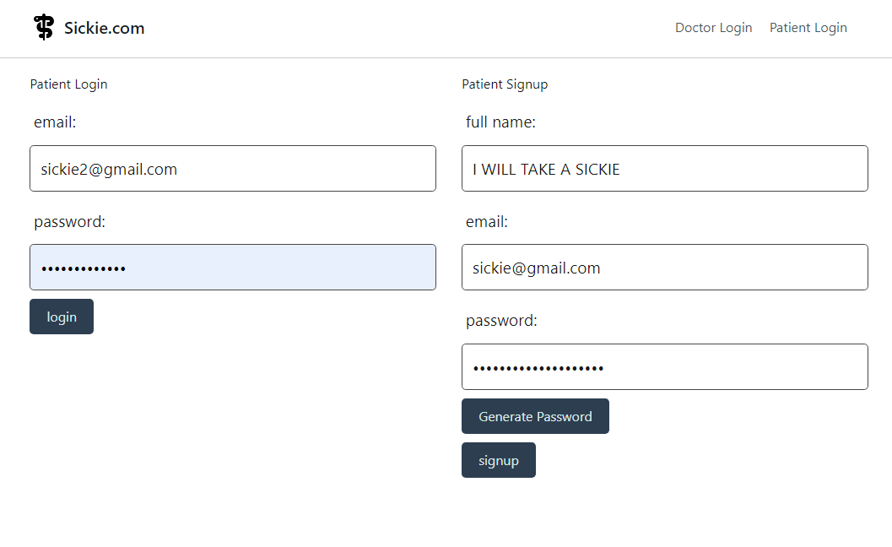

# Take a Sickie

## 📄 Description 

Latest video game release? Hungover from last night? Important work meeting with the boss? Say no more our doctors have a medical certificate for you.
No questions asked.   
https://sickie-com-072b043c893e.herokuapp.com

 

Sickie.com is a user-friendly mockup medical website, designed to simplify the process of requesting medical certificates. Users can seamlessly sign in or sign up to submit their requests, ensuring a hassle-free experience.

Key Features:

User Authentication: Implemented using Node.js, Express.js, and bcrypt for secure user sign in/sign up functionality.
Data Management: Utilized MySQL database with Sequelize ORM for efficient data storage and retrieval.
Dynamic Frontend: Created dynamic web pages with Express Handlebars, enhancing user interactivity.
Session Management: Implemented express-session for maintaining user sessions and ensuring secure interactions.
Responsive Design: Tailwind CSS and Bootstrap were employed for responsive and visually appealing UI/UX.
Environment Management: Utilized dotenv for secure management of environment variables.
Code Quality: Maintained code integrity and quality using ESLint for consistent coding standards.
Automatic Restart: nodemon enabled automatic server restarts, ensuring seamless development and testing.
Deployment: Hosted on Heroku, providing a reliable platform for the live application.

## 📓 Table of Contents

- [Take a Sickie](#take-a-sickie)
  - [📄 Description](#-description)
  - [📓 Table of Contents](#-table-of-contents)
  - [🪛 Technologies used](#-technologies-used)
  - [🖥️Installation](#️installation)
  - [💬Usage](#usage)
  - [🖼️Screenshot](#️screenshot)
  - [📹Video](#video)
  - [⚖️License](#️license)
  - [🤝Contributing](#contributing)
  - [🛠️Tests](#️tests)
  - [❔Questions](#questions)

## 🪛 Technologies used

| Technology           | Description                        | Link                                               |
|----------------------|------------------------------------|----------------------------------------------------|
| Node.js              | JavaScript runtime environment      | [Node.js](https://nodejs.org/)                     |
| NPM                  | Node.js Package Manager            | [NPM](https://www.npmjs.com/)                     |
| Express.js           | Web application framework for Node | [Express.js](https://www.npmjs.com/package/express) |
| Express Handlebars   | Templating engine for Express       | [Express Handlebars](https://www.npmjs.com/package/express-handlebars) |
| express-session      | Session middleware for Express      | [express-session](https://www.npmjs.com/package/express-session) |
| mysql2               | MySQL client for Node.js            | [mysql2](https://www.npmjs.com/package/mysql2)     |
| Sequelize            | Promise-based ORM for Node.js       | [Sequelize](https://www.npmjs.com/package/sequelize)|
| dotenv               | Loads environment variables         | [dotenv](https://www.npmjs.com/package/dotenv)     |
| bcrypt               | Password hashing function           | [bcrypt](https://www.npmjs.com/package/bcrypt)     |
| Heroku               | Cloud platform for deployment      | [Heroku](https://heroku.com/)                      |
| ESLint               | JavaScript linter                  | [ESLint](https://www.npmjs.com/package/eslint)     |
| Tailwind CSS         | Utility-first CSS framework         | [Tailwind CSS](https://www.npmjs.com/package/tailwindcss) |
| Bootstrap            | Front-end CSS framework             | [Bootstrap](https://www.npmjs.com/package/bootstrap)|
| nodemon              | Monitor for changes in your code    | [nodemon](https://nodemon.io/)                    |
| Password generator   | Utility to generate passwords       | [Password generator](https://www.npmjs.com/package/generate-password) |

    
## 🖥️Installation 

Deployed on Heroku at 
https://sickie-com-072b043c893e.herokuapp.com
  
## 💬Usage 

For illegal purposes only

## 🖼️Screenshot

Take a sickie homepage

Patient Signup and login 

## 📹Video

Shows a new patient signing up 

## ⚖️License 

This project is licensed under MIT
  
## 🤝Contributing 

Brian Trang,  
Jarrod Blanning,  
Thorsten Beowulf,  
Hailin Ruan    
With thanks to USYD
  
## 🛠️Tests

N/A
 
## ❔Questions

If you have any questions about this project, please contact me directly at Brian.trang9@gmail.com.  
Feel free to view more of our projects at   
https://github.com/MakeRedundant  
https://github.com/ThorstenBeowulf  
https://github.com/jarrodbb  
https://github.com/Hailin-Ruan  
